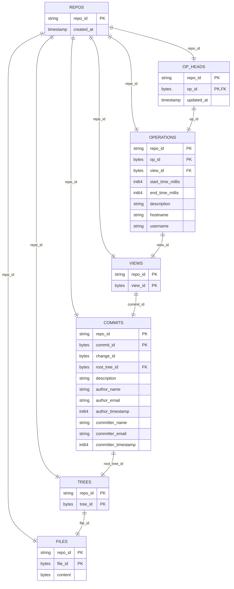

# jj Commit Cloud Proof-of-Concept

This project provides a proof-of-concept or reference implementation of a commit
cloud for [jj](http://github.com/jj-vcs/jj). It is beginning life as an intern
project for one intern sponsored by Google. No guarantee of completeness,
performance, or API stability is promised at this time.

---

# Jujutsu Commit Cloud Architecture & Technical Documentation

> **Internal Reference & Specification Guide**  
> Document Version: `1.0.0` (Targeting `srachaba-rpc` / `srachaba-storage` design)

---

## Table of Contents
- [Part 1: The Workflow & Repository Initialization](#part-1-the-workflow--repository-initialization)
  - [1.1 Server Startup & Configuration](#11-server-startup--configuration)
  - [1.2 Client Initialization (`jj cc init`)](#12-client-initialization-jj-cc-init)
  - [1.3 Local Metadata Schema (`config.toml` & `type`)](#13-local-metadata-schema-configtoml--type)
  - [1.4 Remote Repository Registration](#14-remote-repository-registration)
  - [1.5 Git Repository Import Pipeline (`jj cc import-git`)](#15-git-repository-import-pipeline-jj-cc-import-git)
- [Part 2: Backend Trait, RPC Services & Protobuf Definitions](#part-2-backend-trait-rpc-services--protobuf-definitions)
  - [2.1 Client Backend Trait (`CommitCloudBackend`)](#21-client-backend-trait-commitcloudbackend)
  - [2.2 Client OpStore & OpHeadsStore Traits](#22-client-opstore--opheadsstore-traits)
  - [2.3 gRPC Service Interfaces (`BackendService` & `OpStoreService`)](#23-grpc-service-interfaces-backendservice--opstoreservice)
- [Part 3: Server Binary (`jj-cc-server`) & Cloud Run Deployment](#part-3-server-binary-jj-cc-server--cloud-run-deployment)
  - [3.1 `jj-cc-server` Binary & CLI Flags](#31-jj-cc-server-binary--cli-flags)
  - [3.2 Health Check & Service Registration](#32-health-check--service-registration)
  - [3.3 Cloud Run Deployment & Authentication Token Export](#33-cloud-run-deployment--authentication-token-export)
  - [3.4 Pluggable Storage Layer (`DatabaseStore` Trait & Server Commands)](#34-pluggable-storage-layer-databasestore-trait--server-commands)
- [Part 4: Database Schema & Entity Relationships](#part-4-database-schema--entity-relationships)
  - [4.1 Storage Multi-Tenancy Design](#41-storage-multi-tenancy-design)
  - [4.2 Entity Relationship Diagram (Mermaid Schema & Key Links)](#42-entity-relationship-diagram-mermaid-schema--key-links)
  - [4.3 Entity Relationships & Key Navigation](#43-entity-relationships--key-navigation)

---

## Part 1: The Workflow & Repository Initialization

This section outlines how the `jj-cc-server` process starts, how `jj cc init` initializes local repository metadata, how UUID repository identifiers are generated, and how local client state links to the remote commit cloud server.

### 1.1 Server Startup & Configuration

The Commit Cloud server daemon (`jj-cc-server`) is launched as a background process or containerized daemon. It accepts host/port bindings and database backend regime parameters:

```bash
# Start server using persistent SQLite storage
$ jj-cc-server --host 0.0.0.0 --port 8080 --db-backend sqlite --db-path /var/data/commit_cloud.db

# Start server using Cloud Spanner storage
$ jj-cc-server --host 0.0.0.0 --port 8080 --db-backend spanner --db-path projects/my-project/instances/my-instance/databases/my-db

# Start server in ephemeral port mode (used by testutils harness)
$ jj-cc-server --port=0
```

When started with `--port=0`, the OS dynamically allocates an available ephemeral port. The server prints its listening address to stdout (e.g. `jj-cc-server listening on 127.0.0.1:41235`), allowing test harnesses (`testutils::spawn_server()`) to capture the assigned port dynamically without port collision risks.

---

### 1.2 Client Initialization (`jj cc init`)

To register a workspace with Commit Cloud, a developer runs `jj cc init` inside a directory:

```bash
# Initialize a new Commit Cloud repository pointed to a remote server
$ jj cc init --server http://127.0.0.1:8080 --create .
```

#### Step-by-Step Execution Sequence of `jj cc init`:
1. **UUID Generation**: The client CLI generates a universally unique identifier (UUID v4) for the repository (e.g., `f47ac10b-58cc-4372-a567-0e02b2c3d479`).
2. **Directory Scaffolding**: Creates local `.jj/repo/store/`, `.jj/repo/op_store/`, and `.jj/repo/op_heads/` metadata directories.
3. **Type Specification Files**:
   * Writes `"commit_cloud"` to `.jj/repo/store/type`.
   * Writes `"commit_cloud"` to `.jj/repo/store/op_store/type`.
   * Writes `"commit_cloud"` to `.jj/repo/store/op_heads/type`.
4. **Configuration Serialization**: Writes `.jj/repo/store/config.toml`.
5. **Remote Server Registration**: Issues a gRPC `RegisterRepository` RPC to `jj-cc-server` to register the new `repo_id`.
6. **Root Commit & View Creation**: Initializes the Jujutsu root commit (`00000000...`), root view, and root operation on the remote server.

---

### 1.3 Local Metadata Schema (`config.toml` & `type`)

The store type files instruct Jujutsu's `StoreFactoriesExt` plugin registry to instantiate `CommitCloudBackend`, `CommitCloudOpStore`, and `CommitCloudOpHeadsStore` rather than local file-backed stores.

#### `.jj/repo/store/config.toml` Schema:
```toml
# Remote Commit Cloud server endpoint (HTTP/2 gRPC URL)
server_url = "http://127.0.0.1:8080"

# Globally unique tenant repository ID (UUID v4)
repo_id = "f47ac10b-58cc-4372-a567-0e02b2c3d479"
```

---

### 1.4 Remote Repository Registration

When `jj cc init` executes, it connects to the `server_url` over gRPC and invokes the `RegisterRepository` RPC to register `repo_id` with the server before subsequent read/write requests are permitted.

---

### 1.5 Git Repository Import Pipeline (`jj cc import-git`)

To import an existing Git repository directly into Commit Cloud, the CLI provides the `jj cc import-git` command:

```bash
# Import an existing local Git repository into a new Commit Cloud repository
$ jj cc import-git --git-dir /path/to/my-git-project --repo-id my-project-id --server https://my-commit-cloud-server.run.app
```

#### How the Git Importer Works:
1. **Repository Discovery (`gix`)**: Uses `gix` (Gitoxide) to read local `.git` commits, directory trees, file blobs, and branch heads.
2. **Parallel Worker Upload Pipeline**: Launches workers in parallel to upload file blobs, directory trees, and commit objects concurrently over gRPC (`WriteFile`, `WriteTree`, `WriteCommit`), maximizing network throughput.
3. **OpStore Initialization**: Constructs initial Jujutsu `View`, `Operation`, and `OpHeads` records on the remote server corresponding to all imported Git branch heads.
4. **Workspace Linking**: Once imported, developers can connect local workspaces to the newly populated cloud repository by running:
   ```bash
   $ jj cc init --server https://my-commit-cloud-server.run.app --repo-id my-project-id
   ```

---

## Part 2: Backend Trait, RPC Services & Protobuf Definitions

### 2.1 Client Backend Trait (`CommitCloudBackend`)

`CommitCloudBackend` (located in `lib/src/cc_backend.rs`) implements `jj_lib::backend::Backend`. It translates Jujutsu's high-level backend method calls into gRPC network calls.

* **Trait Metadata**: `name() -> "commit_cloud"`, 20-byte SHA-1 commit IDs, 16-byte change IDs, root commit ID, root change ID, empty tree ID.
* **Storage Operations**: Wraps `ReadCommit`, `WriteCommit`, `ReadTree`, `WriteTree`, streaming `ReadFile`, and `WriteFile`.

---

### 2.2 Client OpStore & OpHeadsStore Traits

`CommitCloudOpStore` and `CommitCloudOpHeadsStore` (located in `lib/src/cc_op_store.rs` and `lib/src/cc_op_heads_store.rs`) implement Jujutsu's `OpStore` and `OpHeadsStore` traits.

* **`CommitCloudOpStore`**: Implements operation graph reads/writes (`ReadOperation`, `WriteOperation`) and workspace view snapshots (`ReadView`, `WriteView`).
* **`CommitCloudOpHeadsStore`**: Implements active operation graph head queries (`GetOpHeads`) and updates (`UpdateOpHeads`).

---

### 2.3 gRPC Service Interfaces (`BackendService` & `OpStoreService`)

The gRPC contract defines two service interfaces:

#### 1. `BackendService` Protobuf Service (`common/proto/backend.proto`)
```protobuf
syntax = "proto3";
package commit_cloud.backend;

service BackendService {
  rpc RegisterRepository (RegisterRepositoryRequest) returns (RegisterRepositoryResponse);
  rpc ReadCommit (ReadCommitRequest) returns (ReadCommitResponse);
  rpc WriteCommit (WriteCommitRequest) returns (WriteCommitResponse);
  rpc ReadTree (ReadTreeRequest) returns (ReadTreeResponse);
  rpc WriteTree (WriteTreeRequest) returns (WriteTreeResponse);
  rpc ReadFile (ReadFileRequest) returns (stream ReadFileResponse);
  rpc WriteFile (WriteFileRequest) returns (WriteFileResponse);
  rpc ReadSymlink (ReadSymlinkRequest) returns (ReadSymlinkResponse);
  rpc WriteSymlink (WriteSymlinkRequest) returns (WriteSymlinkResponse);
}
```

#### 2. `OpStoreService` Protobuf Service (`common/proto/op_store.proto`)
```protobuf
syntax = "proto3";
package commit_cloud.op_store;

service OpStoreService {
  rpc ReadOperation (ReadOperationRequest) returns (ReadOperationResponse);
  rpc WriteOperation (WriteOperationRequest) returns (WriteOperationResponse);
  rpc ReadView (ReadViewRequest) returns (ReadViewResponse);
  rpc WriteView (WriteViewRequest) returns (WriteViewResponse);
  rpc GetOpHeads (GetOpHeadsRequest) returns (GetOpHeadsResponse);
  rpc UpdateOpHeads (UpdateOpHeadsRequest) returns (UpdateOpHeadsResponse);
}
```

---

## Part 3: Server Binary (`jj-cc-server`) & Cloud Run Deployment

### 3.1 `jj-cc-server` Binary & CLI Flags

`jj-cc-server` (located in `server/src/main.rs`) is the production binary. It parses command-line arguments via `clap`:

| CLI Flag | Default Value | Description |
| :--- | :--- | :--- |
| `--host` | `127.0.0.1` | Network interface IP to bind HTTP/2 gRPC listener. Use `0.0.0.0` in Docker/Cloud Run. |
| `--port` | `8080` | Port to listen on. Use `0` for dynamic ephemeral OS port allocation. |
| `--db-backend` | `sqlite` | Backend database storage engine (`sqlite`, `spanner`). |
| `--db-path` | `None` | Path to SQLite file or Spanner connection string. |

---

### 3.2 Health Check & Service Registration

The server registers `tonic_health` alongside `BackendService` and `OpStoreService`:

```rust
let (mut health_reporter, health_service) = tonic_health::server::health_reporter();
health_reporter.set_service_status("", tonic_health::ServingStatus::Serving).await;

Server::builder()
    .add_service(health_service)
    .add_service(BackendServiceServer::new(backend_service))
    .add_service(OpStoreServiceServer::new(op_store_service))
    .serve_with_incoming_shutdown(incoming, shutdown_signal())
    .await?;
```

---

### 3.3 Cloud Run Deployment & Authentication Token Export

#### 1. Exporting Google Identity Token (`JJ_CC_AUTH_TOKEN`)
Before executing CLI commands against a Cloud Run deployment, export your Google Identity token:

```bash
$ export JJ_CC_AUTH_TOKEN=$(gcloud auth print-identity-token)
```

#### 2. Multi-Stage Container Build
Cloud Run does **not** need a Rust compiler at runtime. Rust code compiles into a single, standalone native machine-code binary.

```dockerfile
# Stage 1: Build binary using official Rust image
FROM rust:1.80-slim AS builder
WORKDIR /usr/src/jj-commit-cloud
COPY . .
RUN cargo build --release -p jj-commit-cloud-server

# Stage 2: Production runtime image (Distroless, ~20MB image)
FROM gcr.io/distroless/cc-debian12
COPY --from=builder /usr/src/jj-commit-cloud/target/release/jj-cc-server /usr/local/bin/jj-cc-server
EXPOSE 8080
ENTRYPOINT ["/usr/local/bin/jj-cc-server", "--host", "0.0.0.0", "--port", "8080"]
```

#### 3. Deploying to Cloud Run
```bash
# Deploy jj-cc-server to Cloud Run with gcloud CLI
$ gcloud run deploy jj-cc-server \
    --image gcr.io/$PROJECT_ID/jj-cc-server:latest \
    --platform managed \
    --region us-central1 \
    --allow-unauthenticated \
    --use-http2 \
    --set-env-vars DB_BACKEND=spanner,SPANNER_DATABASE=projects/$PROJECT_ID/instances/jj-instance/databases/jj-db
```

---

### 3.4 Pluggable Storage Layer (`DatabaseStore` Trait & Server Commands)

`jj-cc-server` decouples gRPC service handlers from storage engines using the `DatabaseStore` trait in `server/src/db/db_store.rs`.

The `DatabaseStore` trait defines the unified asynchronous interface for repository registration, commit/tree/file storage, and operation log management across pluggable storage engines.

#### Launch Commands by Storage Engine:

1. **SQLite Persistent Storage Engine (`SqliteStore`)**:
   ```bash
   $ jj-cc-server --host 0.0.0.0 --port 8080 --db-backend sqlite --db-path /var/data/commit_cloud.db
   ```
2. **Google Cloud Spanner Storage Engine (`SpannerStore`)**:
   ```bash
   $ jj-cc-server --host 0.0.0.0 --port 8080 --db-backend spanner --db-path projects/my-project/instances/my-instance/databases/my-db
   ```

---

## Part 4: Database Schema & Entity Relationships

### 4.1 Storage Multi-Tenancy Design

To support hosting multiple repositories on a single Commit Cloud server instance, every database table uses a compound composite primary key: `(repo_id, object_id)`.

---

### 4.2 Entity Relationship Diagram (Mermaid Schema & Key Links)



---

### 4.3 Entity Relationships & Key Navigation

1. **`REPOS.repo_id`**: Links `REPOS` to all multi-tenant storage tables (`OP_HEADS`, `OPERATIONS`, `VIEWS`, `COMMITS`, `TREES`, `FILES`).
2. **`OP_HEADS.op_id` $\rightarrow$ `OPERATIONS.op_id`**: Points to active operation graph heads.
3. **`OPERATIONS.view_id` $\rightarrow$ `VIEWS.view_id`**: References the snapshot view associated with an operation.
4. **`VIEWS` $\rightarrow$ `COMMITS.commit_id`**: Maps workspace heads and bookmarks to target commits.
5. **`COMMITS.root_tree_id` $\rightarrow$ `TREES.tree_id`**: References the root directory tree for a commit.
6. **`TREES` $\rightarrow$ `FILES.file_id`**: Maps directory entries to binary file blobs.

---

## Source Code Headers

Every file containing source code must include copyright and license
information. This includes any JS/CSS files that you might be serving out to
browsers. (This is to help well-intentioned people avoid accidental copying that
doesn't comply with the license.)

Apache header:

    Copyright 2026 Google LLC

    Licensed under the Apache License, Version 2.0 (the "License");
    you may not use this file except in compliance with the License.
    You may obtain a copy of the License at

        https://www.apache.org/licenses/LICENSE-2.0

    Unless required by applicable law or agreed to in writing, software
    distributed under the License is distributed on an "AS IS" BASIS,
    WITHOUT WARRANTIES OR CONDITIONS OF ANY KIND, either express or implied.
    See the License for the specific language governing permissions and
    limitations under the License.
