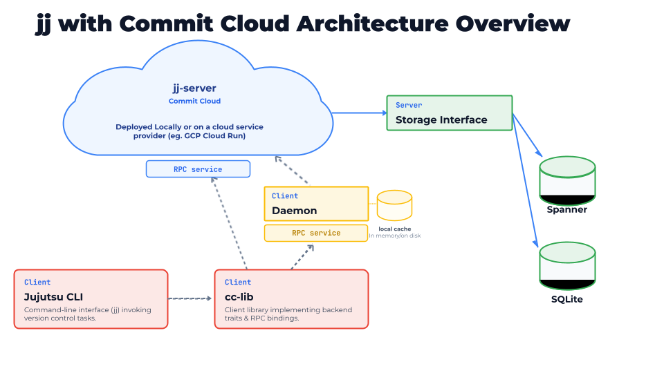

# Architecture

## Crates

| Crate | Dependencies | Description |
| :--- | :--- | :--- |
| **cc-lib** | **common**, **jj-lib** *(upstream)* | Implements Jujutsu's core storage traits (**Backend**, **OpStore**, **OpHeadsStore**, **WorkingCopy**) backed by gRPC calls to the Commit Cloud server. It also provides the **GitImporter** module. |
| **cli** | **cc-lib**, **jj-lib** *(upstream)*, **jj-cli** *(upstream)* | Builds the custom **jj** binary that registers the Commit Cloud storage factories with **jj-cli**. It also adds custom subcommands (**jj cc init** and **jj cc import-git**) for initializing remote-backed workspaces and importing Git repositories. |
| **cc-server** | **common**, **jj-lib** *(upstream)* | Implements the gRPC service handlers and connects to the backend storage layer. Is the "commit cloud". |
| **testutils** | None *(compiles **cc-server** and **daemon** in build.rs)* | Provides the integration test harness for spawning isolated Commit Cloud servers and running CLI commands in temporary directories.|
| **daemon** *(as of srachaba-daemon)* | **common** | Runs a local background proxy listening on a Unix Domain Socket to eliminate network connection startup overhead. It forwards client RPCs over a persistent connection to the remote server. |
| **common** | **jj-lib** *(upstream)* | Contains the Protbuf definitions, helper functions, and shared constants. |

## Client

Implements the **Backend**, **OpStore**, **OpHeadsStore**, **IndexStore**, and **WorkingCopy** traits of **jj-lib** (**CommitCloudBackend**, **CommitCloudOpStore**, **CommitCloudOpHeadsStore**, **CommitCloudIndexStore**, **CommitCloudWorkingCopy**). They make RPC calls to the remote server.

## RPC Layer

Defined in the **common** package using Protocol Buffers and Tonic gRPC stubs across three services: **BackendService**, **OpStoreService**, and **WorkspaceService**.

## Backend Schema & Store

The server defines an async **Store** trait containing all database storage functions so that the persistence layer is easily pluggable for any backend database. **SqliteStore** and **SpannerStore** (as well as **MemoryStore**) implement this **Store** trait.

* **As of main branch**: [database_schema_main.md](./database_schema_main.md)
* **As of current branch**: [database_schema.md](./database_schema.md)

## Workflow

* [workflow.md](./workflow.md)
