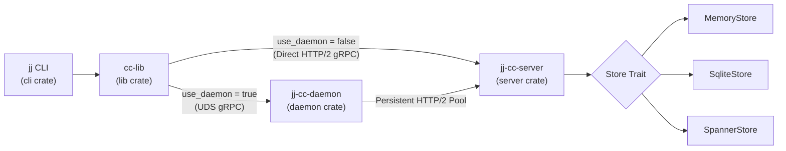
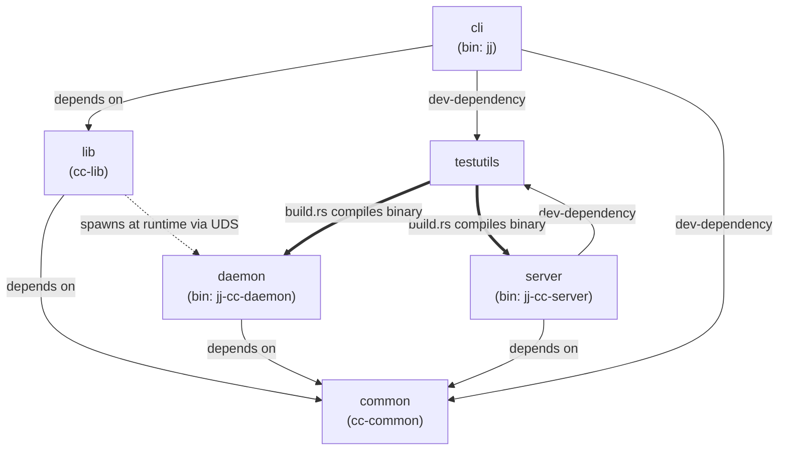
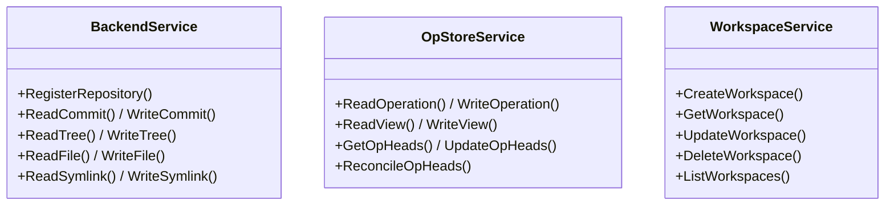

# Architecture Overview

Commit Cloud decouples Jujutsu (`jj`) storage from the local filesystem into a remote gRPC server (`jj-cc-server`) with optional local Unix Domain Socket (UDS) connection pooling via `jj-cc-daemon`.

---

## End-to-End System Flow

---

## Workspace Package Dependency Graph

The workspace consists of 6 Rust packages. Arrows indicate compile-time, dev, and build-script relationships:

| Package | Binary / Lib | Role |
| :--- | :--- | :--- |
| **`common`** | `cc-common` | Protobuf schemas (`backend.proto`, `op_store.proto`, `workspace.proto`) & `jj-lib` $\leftrightarrow$ Proto conversions. |
| **`lib`** | `cc-lib` | Cloud implementations of `jj-lib` traits (`Backend`, `OpStore`, `OpHeadsStore`, `WorkingCopy`). |
| **`cli`** | `jj` | Custom `jj` binary integrating `cc-lib` and subcommands (`jj cc init`, `jj cc daemon`, `jj cc import-git`). |
| **`daemon`** | `jj-cc-daemon` | Local UDS proxy server that multiplexes CLI calls over a single persistent HTTP/2 connection. |
| **`server`** | `jj-cc-server` | Remote gRPC server implementing object storage, workspace tracking, and op head reconciliation. |
| **`testutils`** | `testutils` | Test harness whose `build.rs` compiles `jj-cc-server` and `jj-cc-daemon` for integration tests. |

---

## gRPC Services

