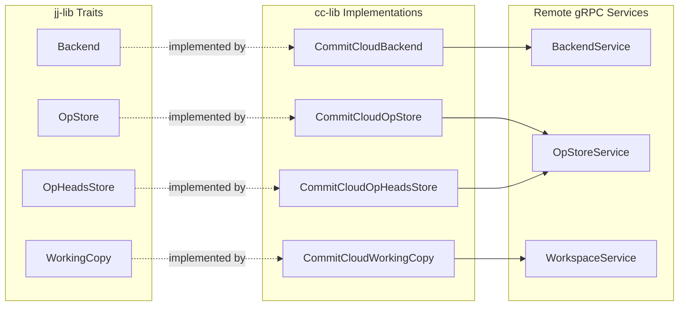
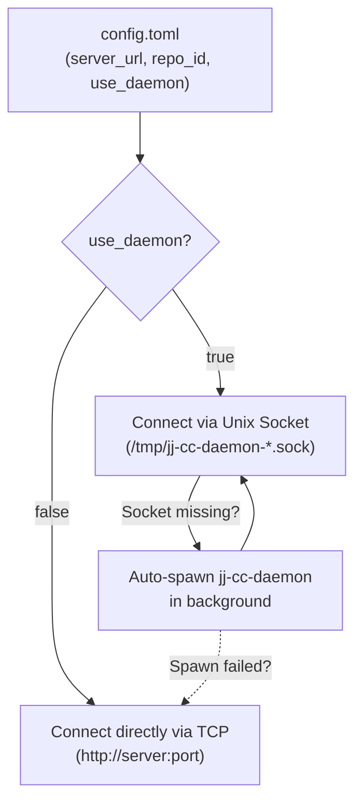

# Client Library (`cc-lib`)

`cc-lib` implements Jujutsu's core storage traits, redirecting local file operations to remote gRPC calls (either directly over TCP or via the local UDS daemon).

---

## `jj-lib` Trait Implementations



| Implementation | `jj-lib` Trait | Responsibilities |
| :--- | :--- | :--- |
| **`CommitCloudBackend`** | `Backend` | Reads and writes commits, trees, file blobs, and symlinks via `BackendService`. |
| **`CommitCloudOpStore`** | `OpStore` | Reads and writes operation log nodes and repository views via `OpStoreService`. |
| **`CommitCloudOpHeadsStore`** | `OpHeadsStore` | Fetches active operation heads, triggers server-side reconciliation on divergent heads (`ReconcileOpHeads`), and updates heads after transactions. |
| **`CommitCloudWorkingCopy`** | `WorkingCopy` | Tracks checked-out commit, tree, and operation state remotely via `WorkspaceService` while snapshotting local workspace files. |

---

## Repository Configuration (`config.toml`)

Each initialized Commit Cloud workspace stores minimal connection metadata locally at:
`.jj/repo/store/commit_cloud/config.toml`

```toml
# Remote Commit Cloud gRPC server address
server_url = "http://127.0.0.1:8080"

# Unique server-assigned UUID identifying this repository
repo_id = "c4b18e92-7c3d-4a8e-9b1f-2e5a8d3f6c01"

# Route gRPC calls through local jj-cc-daemon over Unix Domain Socket
use_daemon = true

# Optional explicit UDS socket path (defaults to /tmp/jj-cc-daemon-<user>-<hash>.sock)
# daemon_socket = "/tmp/custom.sock"
```


