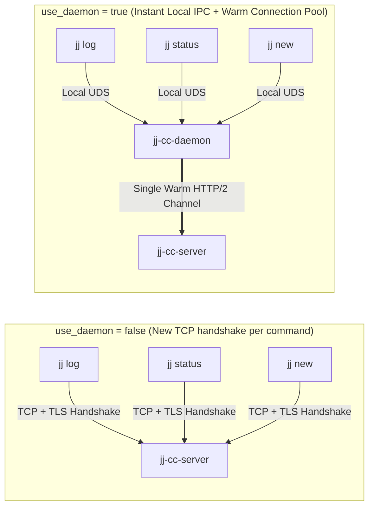
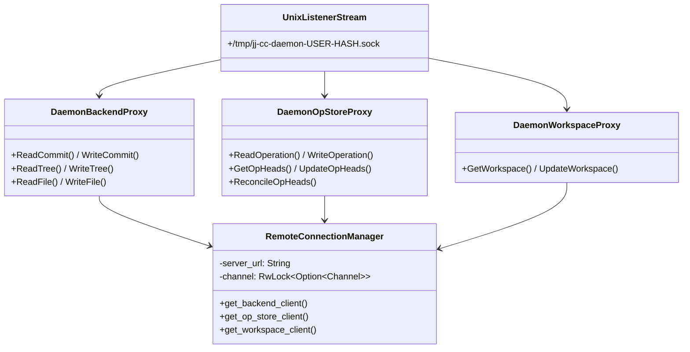
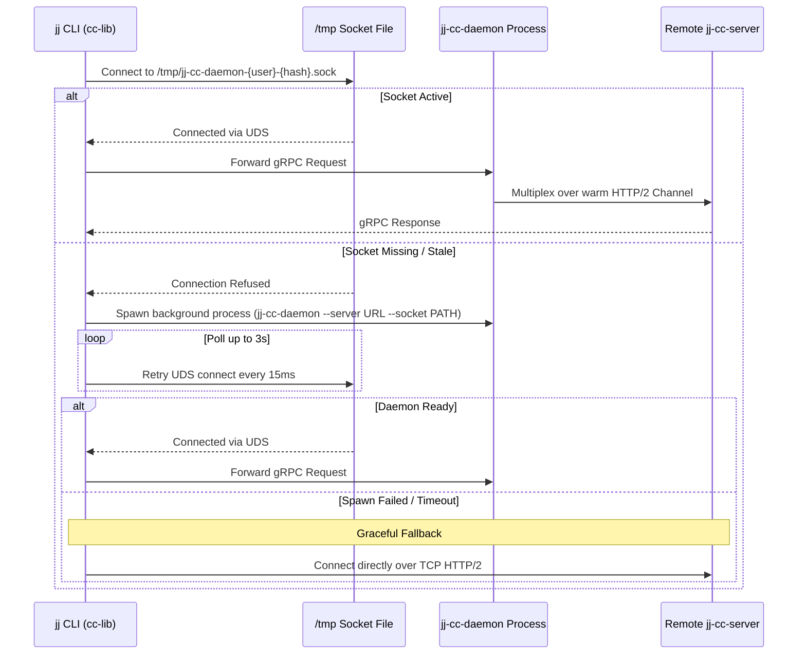

# Local Daemon (`jj-cc-daemon`)

Short-lived `jj` CLI commands incur TCP/TLS connection setup latency on every invocation. `jj-cc-daemon` eliminates this overhead by listening on a local Unix Domain Socket (UDS) and multiplexing all client RPCs over a single persistent HTTP/2 channel.

---

## Without Daemon vs. With Daemon



---

## Daemon Proxy Architecture



---

## Auto-Spawn & Connection Fallback Flow

When `use_daemon = true`, `cc-lib` automatically starts `jj-cc-daemon` on demand:



---

## Daemon CLI Management

```bash
# Start daemon manually in foreground or background
jj cc daemon start --server http://127.0.0.1:8080

# Check daemon connection status
jj cc daemon status

# Stop running daemon and clean up UDS socket
jj cc daemon stop
```
