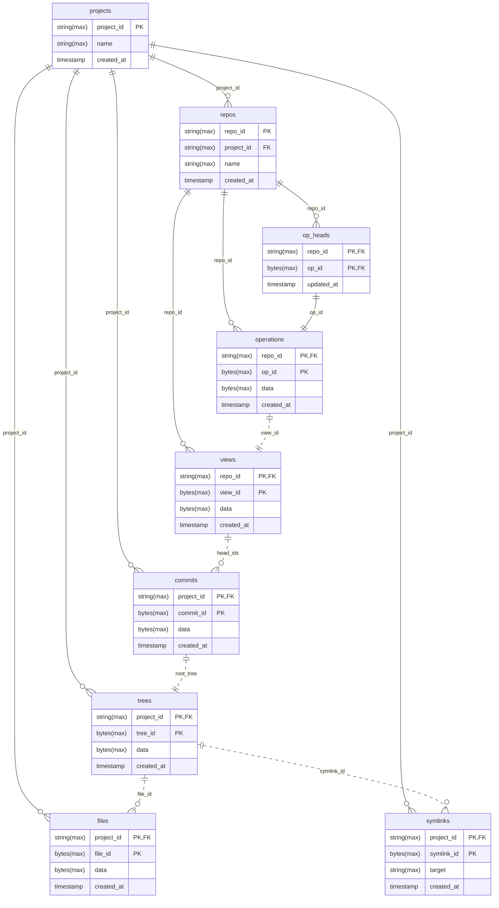

# Database Schema

```mermaid
erDiagram
    projects ||--o{ repos : "project_id"
    projects ||--o{ commits : "project_id"
    projects ||--o{ trees : "project_id"
    projects ||--o{ files : "project_id"
    projects ||--o{ symlinks : "project_id"
    repos ||--o{ op_heads : "repo_id"
    repos ||--o{ operations : "repo_id"
    repos ||--o{ views : "repo_id"
    op_heads ||--|| operations : "op_id"
    operations ||..|| views : "view_id"
    views ||..o{ commits : "head_ids"
    commits ||..|| trees : "root_tree"
    trees ||..o{ files : "file_id"
    trees ||..o{ symlinks : "symlink_id"

    projects {
        string(max) project_id PK
        string(max) name
        timestamp created_at
    }

    repos {
        string(max) repo_id PK
        string(max) project_id FK
        string(max) name
        timestamp created_at
    }

    commits {
        string(max) project_id PK, FK
        bytes(max) commit_id PK
        bytes(max) data
        timestamp created_at
    }

    trees {
        string(max) project_id PK, FK
        bytes(max) tree_id PK
        bytes(max) data
        timestamp created_at
    }

    files {
        string(max) project_id PK, FK
        bytes(max) file_id PK
        bytes(max) data
        timestamp created_at
    }

    symlinks {
        string(max) project_id PK, FK
        bytes(max) symlink_id PK
        string(max) target
        timestamp created_at
    }

    op_heads {
        string(max) repo_id PK, FK
        bytes(max) op_id PK, FK
        timestamp updated_at
    }

    operations {
        string(max) repo_id PK, FK
        bytes(max) op_id PK
        bytes(max) data
        timestamp created_at
    }

    views {
        string(max) repo_id PK, FK
        bytes(max) view_id PK
        bytes(max) data
        timestamp created_at
    }
```
