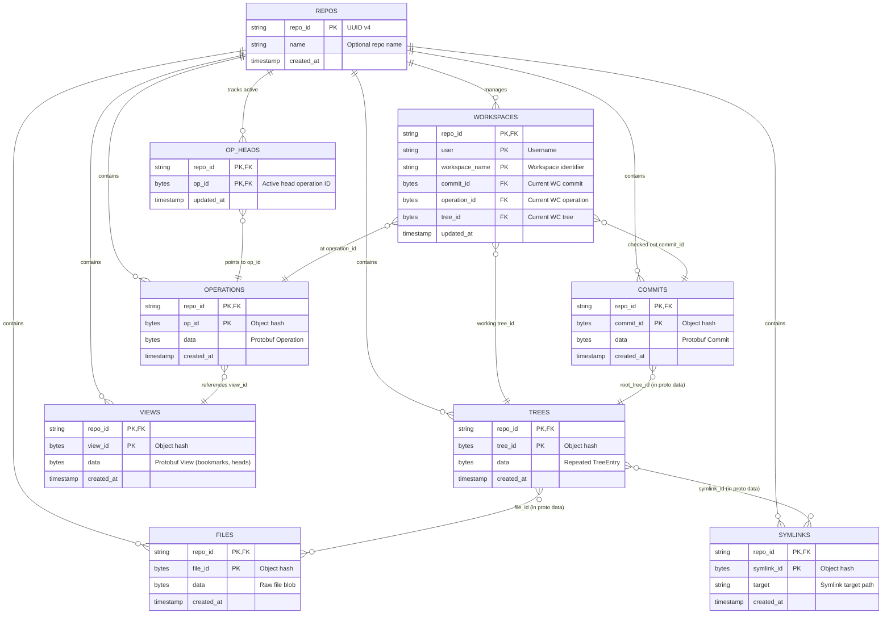

# Storage Backend & Schema Design

The server persists all Jujutsu repository objects, operation logs, and workspace pointers through an asynchronous, pluggable `Store` trait (`server/src/store/mod.rs`).

---

## Pluggable `Store` Architecture

All gRPC service handlers interact strictly with `Arc<dyn Store>`, enabling interchangeable storage engines without altering business logic.

| Engine | Persistence | Concurrency Model | Target Environment |
| :--- | :--- | :--- | :--- |
| **`MemoryStore`** | Ephemeral RAM | `tokio::sync::RwLock` | Unit tests & rapid prototyping |
| **`SqliteStore`** | Single file DB | `spawn_blocking` + SQLite WAL Transactions | Local single-node server |
| **`SpannerStore`** | Distributed Cloud DB | Spanner Read-Write Transactions | Multi-client Cloud Run production |

### Core Async `Store` Methods
* **Repository Registry:** `is_repo_registered`, `register_repo`
* **Content-Addressed Objects:** `get_commit`/`put_commit`, `get_tree`/`put_tree`, `get_file`/`put_file`, `get_symlink`/`put_symlink`
* **Operation Log & Views:** `get_operation`/`put_operation`, `get_view`/`put_view`
* **Atomic Op Head Updates:**
  * `update_op_heads_append_new_remove_old`: Appends a new operation head and removes parent heads (used by client transactions).
  * `update_op_heads_compare_and_swap`: Atomically replaces the active head set with a single merged head if and only if the active set matches expected heads (used by server-side reconciliation).
* **Workspaces:** `get_workspace`, `put_workspace`, `delete_workspace`, `list_workspaces`

---

## Database Relational Schema (`erDiagram`)

Every entity is scoped to a `repo_id` primary key partition. Content-addressable objects (`commits`, `trees`, `files`, `symlinks`, `operations`, `views`) use their deterministic SHA-1/SHA-256 hash as the second composite primary key column.

