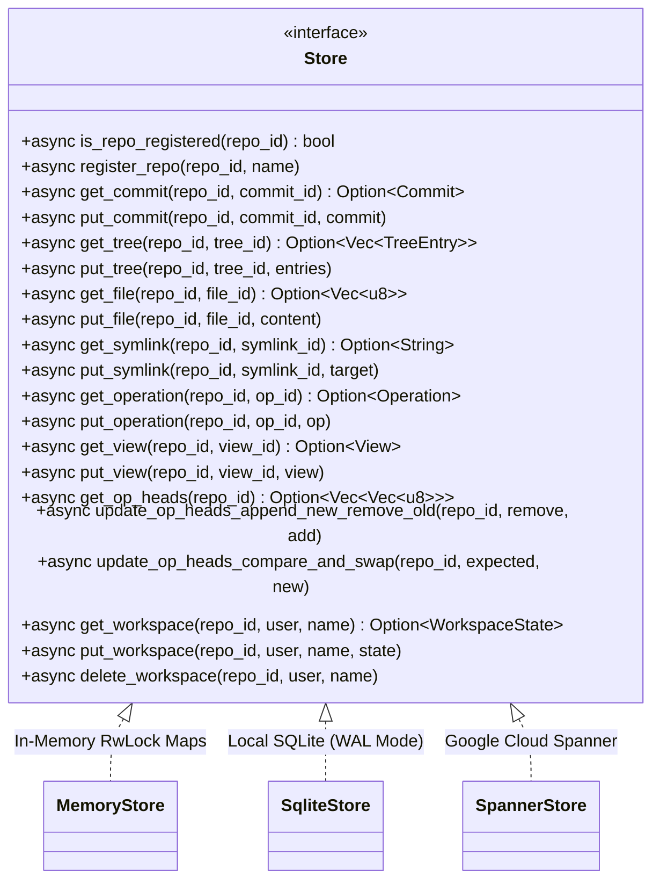
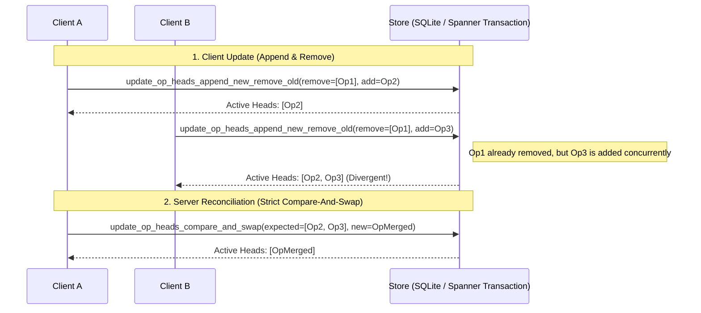

# Storage Backend & Schema Design

The server persists all Jujutsu repository objects, operation logs, and workspace pointers through an asynchronous, pluggable `Store` trait.

---

## Pluggable `Store` Architecture

All gRPC service handlers interact strictly with `Arc<dyn Store>`, enabling interchangeable storage engines without altering business logic.

| Engine | Persistence | Concurrency Model | Target Environment |
| :--- | :--- | :--- | :--- |
| **`MemoryStore`** | Ephemeral RAM | `tokio::sync::RwLock` | Unit tests & rapid prototyping |
| **`SqliteStore`** | Single file DB | `spawn_blocking` + SQLite Transactions | Local single-node server |
| **`SpannerStore`** | Distributed Cloud DB | Spanner Read-Write Transactions | Multi-client Cloud Run production |

---

## Database Relational Schema (`erDiagram`)

Every entity is scoped to a `repo_id` primary key partition. Content-addressable objects (`commits`, `trees`, `files`, `symlinks`, `operations`, `views`) use their deterministic SHA-256 hash as the second composite primary key column.

---

## Atomic Op Head Concurrency Primitives

To support concurrent clients without losing history, `Store` provides two atomic primitives on `OP_HEADS`:

