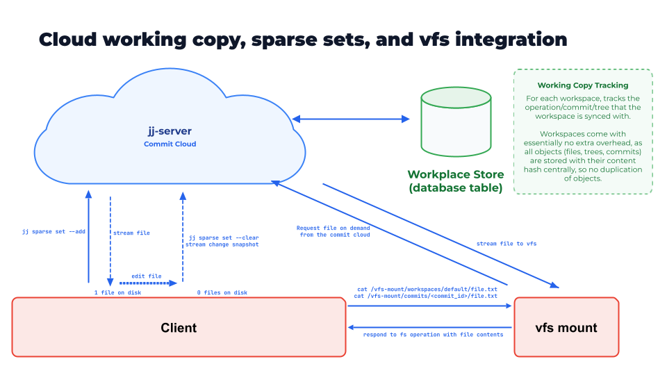

# Commit Cloud Workflow

## 1. Setup Aliases & Start the Server

Configure shell aliases pointing to the compiled Commit Cloud server (**jj-cc-server**), custom Jujutsu CLI (**jj**), and VFS daemon (**jjfsd**) binaries:

```bash
alias sjjs=/path/to/jj-commit-cloud-poc/target/release/jj-cc-server
alias sjj=/path/to/jj-commit-cloud-poc/target/release/jj
alias sjjvfs=/path/to/jj-vfs-poc/target/release/jjfsd
```

Start the Commit Cloud server with the persistent SQLite storage backend *(as of srachaba-3-store-errors)*:

```bash
sjjs --port 8080 --store-type sqlite
```

Or start the server backed by Google Cloud Spanner *(as of srachaba-spanner)*:

```bash
# Spanner works automatically (auto-initializes schema tables)—just provide the Spanner database link:
sjjs --port 8080 --store-type spanner --spanner-db <SPANNER_LINK>
```

## 2. Initialize a Commit Cloud Workspace

Create a workspace directory and initialize it against the running Commit Cloud server:

```bash
mkdir -p /tmp/vfs_demo && cd /tmp/vfs_demo
sjj cc init --server http://localhost:8080
```

## 3. Sparse Checkout & VFS Integration *(as of srachaba-working-copy)*



Clear all physical files from local disk, mount the virtual filesystem, browse commits or workspaces on-demand, and selectively add files back to edit:

```bash
# Clear physical working copy from local disk
sjj sparse set --clear

# Mount the VFS at /tmp/vfs_mount pointing to /tmp/vfs_demo
mkdir -p /tmp/vfs_mount
sjjvfs /tmp/vfs_mount /tmp/vfs_demo

# Browse files at a specific commit ID or workspace via VFS
cat /tmp/vfs_mount/commits/<commit_id>/file.txt
cat /tmp/vfs_mount/workspaces/default/file.txt

# Selectively materialize paths on local disk to edit
sjj sparse set --add file.txt
```

## 4. Import an Existing Git Repository *(as of srachaba-git-hash-import)*

Import an existing local Git repository into a Commit Cloud project and repository:

```bash
sjj cc import-git \
  --git-dir /path/to/local/git/repo \
  --project-id <PROJECT_ID> \
  --repo-id <REPO_ID> \
  --server http://localhost:8080
```
