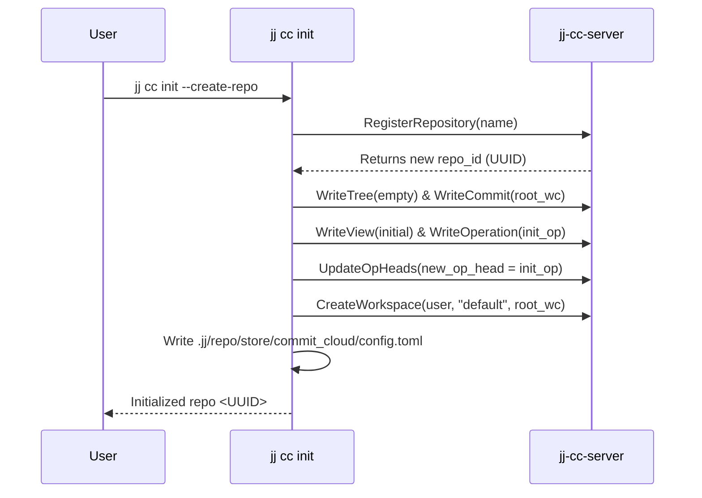
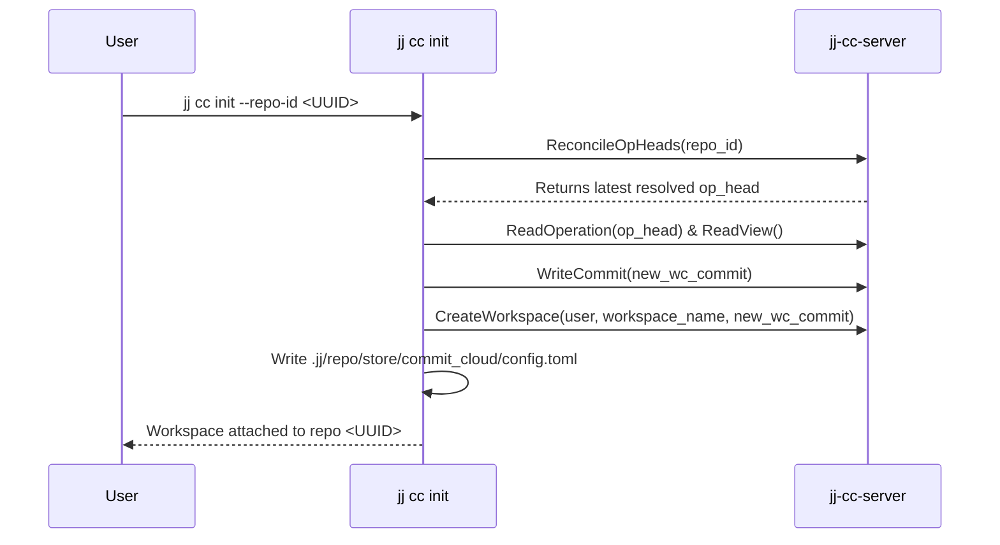
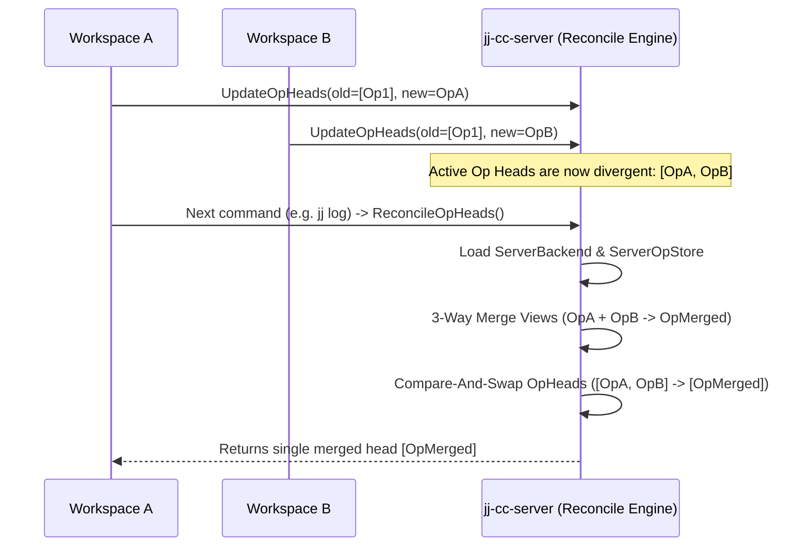
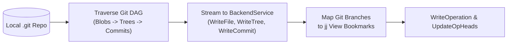

# End-to-End Workflows

This guide illustrates the core workflows for running `jj-cc-server`, initializing cloud repositories, synchronizing across workspaces, and importing Git repositories.

---

## 1. Starting the Server

```bash
# In-Memory Backend (ephemeral)
cargo run --bin jj-cc-server -- --port 8080 --storage memory

# SQLite Backend (local persistent file)
cargo run --bin jj-cc-server -- --port 8080 --storage sqlite --database-path /tmp/cc.db

# Google Cloud Spanner Backend (production)
cargo run --bin jj-cc-server -- --port 8080 --storage spanner \
  --spanner-project my-gcp-project \
  --spanner-instance my-instance \
  --spanner-database my-db
```

---

## 2. Repository Initialization (`jj cc init`)

### A. Create a New Cloud Repository (`--create-repo`)
```bash
jj cc init --server http://127.0.0.1:8080 --create-repo my-project
```



### B. Join an Existing Cloud Repository (`--repo-id`)
```bash
jj cc init --server http://127.0.0.1:8080 --repo-id <EXISTING_UUID> ./workspace-b
```



---

## 3. Concurrent Edits & Auto-Reconciliation

When two workspaces push operations concurrently, the next command automatically reconciles divergent operation heads on the server:



---

## 4. Importing a Git Repository (`jj cc import-git`)

```bash
jj cc import-git --git-dir /path/to/git/repo
```


