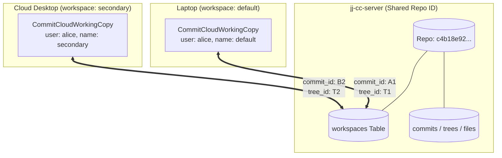
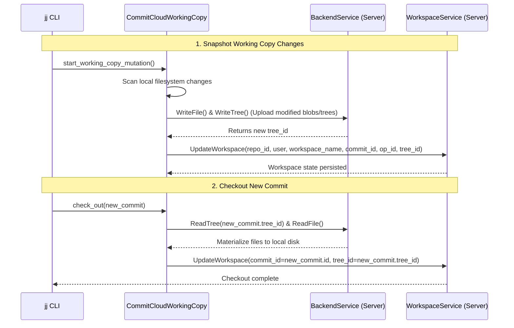

# Cloud Working Copy & Workspaces

`CommitCloudWorkingCopy` decouples workspace state tracking from local state files, storing active workspace checkouts in the remote database via `WorkspaceService`.

---

## Multi-Workspace Cloud Model

Multiple machines or directories can attach to the same `repo_id` while maintaining independent working copy commits:

---

## Working Copy Snapshot & Checkout Lifecycle

---

## `WorkspaceService` RPC Operations

| RPC | Request Fields | Description |
| :--- | :--- | :--- |
| **`CreateWorkspace`** | `repo_id`, `user`, `workspace_name`, `commit_id`, `operation_id`, `tree_id` | Registers a new workspace checkout pointer. |
| **`GetWorkspace`** | `repo_id`, `user`, `workspace_name` | Retrieves the current checked-out commit, tree, and operation for a workspace. |
| **`UpdateWorkspace`** | `repo_id`, `user`, `workspace_name`, `commit_id`, `operation_id`, `tree_id` | Updates workspace pointers after snapshotting or checking out a commit. |
| **`DeleteWorkspace`** | `repo_id`, `user`, `workspace_name` | Removes workspace tracking metadata (`jj workspace forget`). |
